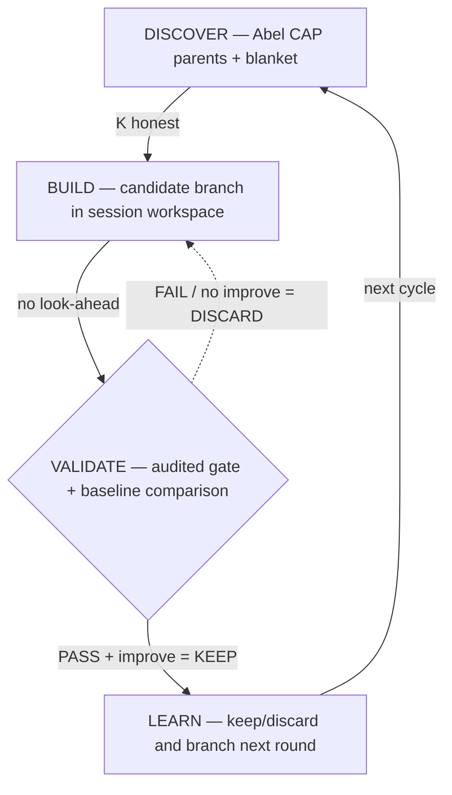

# causal-alpha

**Workspace-first causal alpha discovery for AI agents. Three layers: code enforces, skill guides, agent discovers.**

```bash
python -m venv .venv
# PowerShell: .venv\Scripts\Activate.ps1
# bash/zsh: source .venv/bin/activate
python -m pip install --upgrade pip
pip install -e .
abel-alpha workspace init my-lab
cd my-lab
abel-alpha workspace status
abel-alpha env init
abel-alpha doctor
abel-alpha init-session --ticker TSLA --exp-id tsla-v1 --discover --backtest-start 2020-01-01
abel-alpha init-branch --session research/tsla/tsla-v1 --branch-id graph-v1
abel-alpha run-branch --branch research/tsla/tsla-v1/branches/graph-v1 -d "baseline"
abel-alpha status --session research/tsla/tsla-v1
abel-alpha check --session research/tsla/tsla-v1 --strict
```

`abel-alpha workspace init` creates the standard workspace scaffold and
manifest. The package install still happens from the `Abel-alpha` source
checkout; the workspace is where research artifacts live. `abel-alpha env init`
prepares the workspace `.venv`, installs `Abel-alpha`, and installs
`Abel-edge` from GitHub `main` by default until formal releases exist. Use
`--edge-source` only for local development overrides. `doctor` then inspects
the workspace against that configured target. Inside a workspace,
`abel-alpha init-session` defaults to the manifest-backed `research/` root
instead of relying on an implicit current-directory layout.

## First-Use Flow

Treat this as the standard path for both humans and agents:

1. Install `Abel-alpha` from the local source checkout.
2. Create a workspace with `abel-alpha workspace init <name>`.
3. Run `abel-alpha env init` inside that workspace.
4. Run `abel-alpha doctor` and follow its next step.
5. If auth is missing, install `causal-abel`, complete OAuth once, and rerun `doctor`.
6. Only after the workspace is diagnosably ready, start `init-session`, `init-branch`, and `run-branch`.

If `Abel-alpha` was installed as a skill from GitHub, the installed skill
directory itself is the local source checkout. Run `pip install -e .` from that
directory to expose the packaged `abel-alpha` CLI before creating a workspace.

`abel-alpha doctor` is the default readiness gate:

- `ready`: workspace, edge, and auth are ready
- `auth_missing`: auth is the only missing piece
- `env_missing` or `edge_missing`: rebuild the workspace runtime with `abel-alpha env init`

If you intentionally point the workspace at an older custom `Abel-edge`, `doctor`
may report `ready_legacy_edge` or `auth_missing_legacy_edge`. That means the
fallback path is active and newer structured contracts are unavailable in that
runtime.

If you want live Abel discovery, complete auth before running `init-session --discover` or `causal-edge discover <TICKER>`:

```bash
npx --yes skills add https://github.com/Abel-ai-causality/Abel-skills/tree/main/skills --skill causal-abel -y
# use -g for a global install in the current agent platform
# Abel-alpha does not auto-install causal-abel
# complete causal-abel OAuth once, then causal-edge should reuse the same auth
abel-alpha init-session --ticker TSLA --exp-id tsla-v1 --discover
```

If `causal-edge discover <TICKER>` still reports a missing Abel key after OAuth, `causal-edge` will first read the current project `.env`, then `ABEL_AUTH_ENV_FILE`, then shared `causal-abel` auth files from `.agents/skills/causal-abel/.env.skill` and known OpenCode/Codex global skill roots. That lets agent-driven installs reuse the `causal-abel` auth file without copying the key into each workspace. Use `causal-edge login` only when you want the standalone fallback that stores `ABEL_API_KEY` directly for the current project.

Use `init-session --discover` when you want the live Abel parent/blanket discovery written into `discovery.json` and the session event log from the start, so the narrative layer records discovery as part of the experiment trail instead of leaving it `pending`. `init-session` fixes the session-level backtest start date, and `run-branch` passes that `start` through to `causal-edge evaluate` while leaving `end` unset so each run uses the latest available data.
Without `--discover`, `init-session` still creates the session immediately but writes a pending discovery placeholder instead of running live Abel discovery.

Each `run-branch` now writes `outputs/<round-id>-alpha-context.json` and passes it to `causal-edge evaluate --context-json`. Strategy code should prefer the injected `context` object, especially `context["discovery"]` and `context["discovery_path"]`, instead of assuming a relative workspace layout.
If you intentionally use an older custom `Abel-edge` that does not support `--context-json`, Abel-alpha still records the alpha context artifact, but `run_strategy()` will not receive it until edge is upgraded. `abel-alpha doctor` reports that capability explicitly.
`abel-alpha doctor` also reports whether auth came from the local workspace, the process environment, or a shared external auth file, which matters when validating a clean first-use path.

## Interface Policy

Use the packaged `abel-alpha` CLI as the primary interface. The legacy
`python scripts/research_narrative.py ...` entrypoint remains only as a thin
compatibility wrapper and should not appear in new workflows, docs, or agents.



## Four-Layer Design

```
L1: Raw evaluation (LLM-agnostic)   → causal-edge CLI
    K auto-computed from strategy.py AST
    validate_strategy() runs every experiment
    emits raw verdict, metrics, failures, K

L2: Research organization            → Abel-alpha narrative layer
    session / branch / round structure
    keep/discard and baseline updates
    README / thesis / memory generation

L3: Judgment guidance (skill text)   → SKILL.md
    Explore vs exploit distinction
    Micro-cap parents = the signal
    Validation failures = research direction
    When to declare honest failure

L4: Agent autonomy (留白)            → strategy.py
    What architecture, what features, what ML
    Every asset is different
```

**L1 protects all models. L2 improves strong models. L3 is where alpha lives.**

## Why Causal

Correlation breaks more easily when regimes change. Causation is the default search prior because it is more likely to persist (Pearl, 1995).

- **K is small** — Abel gives ~10 justified parents vs ~10,000 blind scan → DSR honest
- **Signals persist** — causal links survive bull→bear transitions
- **Discovery is automated** — Abel CAP over 11K nodes, agent handles the rest

Correlation-derived signals are allowed, but only as a second-class supplement to a causal thesis. They must earn their place empirically and should not replace Abel-driven discovery as the default search process.

Without Abel, fallback discovery is still useful for research continuity, but it carries weaker discovery evidence: K is effectively higher, confidence is lower, and results should not be described as equivalent to Abel-led causal discovery.

## Production Proof

| | Sharpe | Validation | Backtest |
|---|--------|------------|----------|
| Crypto A | 4.27 | 15/15 PASS | 1,400+ days |
| Crypto B | 2.82 | 15/15 PASS | 1,500+ days |
| Crypto C | 2.10 | 13/13 PASS | 1,100+ days |
| Equity A | 2.57 | 15/15 PASS | 1,000+ days |
| Equity B | 1.69 | 15/15 PASS | 1,200+ days |
| Crypto D | 2.06 | 13/13 PASS | 1,300+ days |

All DSR-deflated (honest K from Abel, not blind scan). All pass [causal-edge](https://github.com/Abel-ai-causality/Abel-edge) full validation. 200+ serial experiments across 6 assets. Zero loss years on best strategies.

Build your own: install `Abel-alpha` from this repo, install `causal-abel` from `Abel-skills/tree/main/skills` if you want shared live Abel auth, then run `abel-alpha init-session --ticker <TICKER> --exp-id <id> --discover`.

## Abel-Pro Mapping

- Abel-alpha worktree for the Abel-Pro integration: `D:\codes\Abel-alpha\.tree\abel-pro`
- Abel-alpha branch for that worktree: `abel-pro`
- Paired Abel-edge worktree for validation and execution: `D:\codes\open_source\Abel-edge\.tree\abel-pro-demo`
- Paired Abel-edge branch: `abel-pro-demo`
- Abel auth and data environment defaults to prod

## Files

```
SKILL.md                  ← Agent reads this. 280 words. 4 judgment calls.
references/
  experiment-loop.md      ← KEEP rule, explore/exploit, when to stop
  discovery-protocol.md   ← Multihop, blanket, fallback
  constraints.md          ← Structural strategy constraints
  proven-patterns.md      ← Battle evidence for inspiration
  methodology.md          ← Axioms vs constraints
```

## The Ecosystem

```
Abel CAP       → causal graph (discovery)
causal-alpha   → research methodology + organization (this skill)
causal-edge    → raw validation facts + edge-owned handoff contract
causal-abel    → Abel API access (cap_probe.py)
```

## License

MIT. Built by [Abel AI](https://github.com/Abel-ai-causality/).
