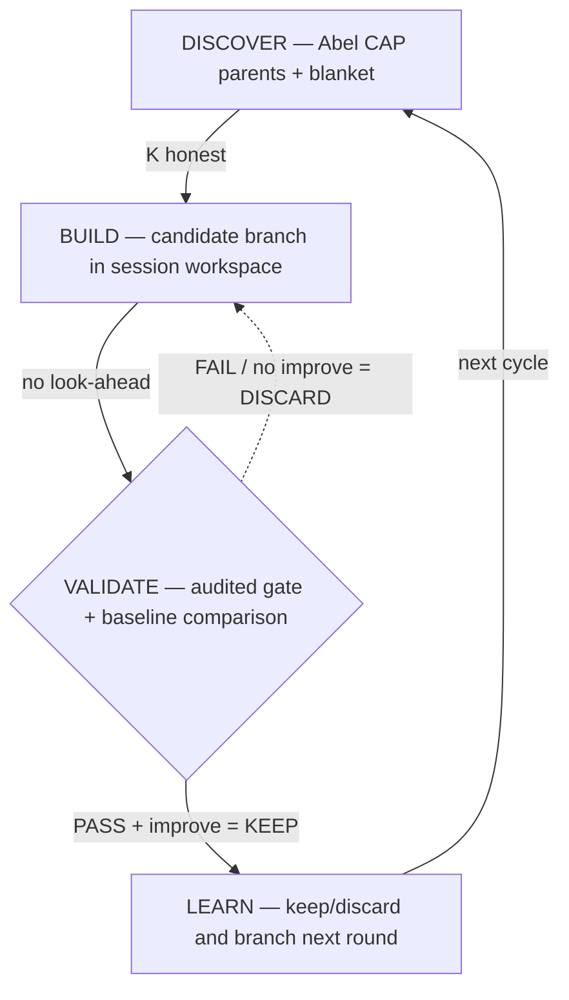

# causal-alpha

**Causal alpha discovery for AI agents. Three layers: code enforces, skill guides, agent discovers.**

```bash
pip install git+https://github.com/Abel-ai-causality/Abel-edge.git
python scripts/research_narrative.py init-session --ticker TSLA --exp-id tsla-v1
python scripts/research_narrative.py init-branch --session research/tsla/tsla-v1 --branch-id graph-v1
python scripts/research_narrative.py run-branch --branch research/tsla/tsla-v1/branches/graph-v1 -d "baseline"
python scripts/research_narrative.py status --session research/tsla/tsla-v1
python scripts/research_narrative.py check --session research/tsla/tsla-v1 --strict
```

If that `git+https` install path fails in your network environment, use the same public repo via zip:

```bash
pip install https://github.com/Abel-ai-causality/Abel-edge/archive/refs/heads/main.zip
```

If `causal-edge discover <TICKER>` reports a missing Abel key, install `causal-abel`, complete its OAuth flow, and rerun the same `discover` command. `causal-edge` will first read the current project `.env`, then `ABEL_AUTH_ENV_FILE`, then `.agents/skills/causal-abel/.env.skill`, so agent-driven installs can reuse the `causal-abel` auth file without copying the key into each workspace.



## Four-Layer Design

```
L1: Raw evaluation (LLM-agnostic)   → causal-edge CLI
    K auto-computed from strategy.py AST
    validate_strategy() runs every experiment
    emits raw verdict, metrics, failures, K

L2: Research organization            → Abel-alpha narrative layer
    session / branch / round structure
    keep/discard and baseline updates
    README / thesis / memory generation

L3: Judgment guidance (skill text)   → SKILL.md
    Explore vs exploit distinction
    Micro-cap parents = the signal
    Validation failures = research direction
    When to declare honest failure

L4: Agent autonomy (留白)            → strategy.py
    What architecture, what features, what ML
    Every asset is different
```

**L1 protects all models. L2 improves strong models. L3 is where alpha lives.**

## Why Causal

Correlation breaks when regimes change. Causation doesn't (Pearl, 1995).

- **K is small** — Abel gives ~10 justified parents vs ~10,000 blind scan → DSR honest
- **Signals persist** — causal links survive bull→bear transitions
- **Discovery is automated** — Abel CAP over 11K nodes, agent handles the rest

## Production Proof

| | Sharpe | Validation | Backtest |
|---|--------|------------|----------|
| Crypto A | 4.27 | 15/15 PASS | 1,400+ days |
| Crypto B | 2.82 | 15/15 PASS | 1,500+ days |
| Crypto C | 2.10 | 13/13 PASS | 1,100+ days |
| Equity A | 2.57 | 15/15 PASS | 1,000+ days |
| Equity B | 1.69 | 15/15 PASS | 1,200+ days |
| Crypto D | 2.06 | 13/13 PASS | 1,300+ days |

All DSR-deflated (honest K from Abel, not blind scan). All pass [causal-edge](https://github.com/Abel-ai-causality/Abel-edge) full validation. 200+ serial experiments across 6 assets. Zero loss years on best strategies.

Build your own: install `Abel-edge`, then run `python scripts/research_narrative.py init-session --ticker <TICKER> --exp-id <id>`.

## Abel-Pro Mapping

- Abel-alpha worktree for the Abel-Pro integration: `D:\codes\causal-alpha\.tree\abel-pro`
- Abel-alpha branch for that worktree: `abel-pro`
- Paired Abel-edge worktree for validation and execution: `D:\codes\open_source\causal-edge\.tree\abel-pro-demo`
- Paired Abel-edge branch: `abel-pro-demo`
- Abel auth and data environment defaults to prod

## Files

```
SKILL.md                  ← Agent reads this. 280 words. 4 judgment calls.
references/
  experiment-loop.md      ← KEEP rule, explore/exploit, when to stop
  discovery-protocol.md   ← Multihop, blanket, fallback
  constraints.md          ← Look-ahead rules (8 constraints)
  proven-patterns.md      ← Battle evidence for inspiration
  methodology.md          ← Axioms vs constraints
```

## The Ecosystem

```
Abel CAP       → causal graph (discovery)
causal-alpha   → research methodology + organization (this skill)
causal-edge    → raw validation facts
causal-abel    → Abel API access (cap_probe.py)
```

## License

MIT. Built by [Abel AI](https://github.com/Abel-ai-causality/).
