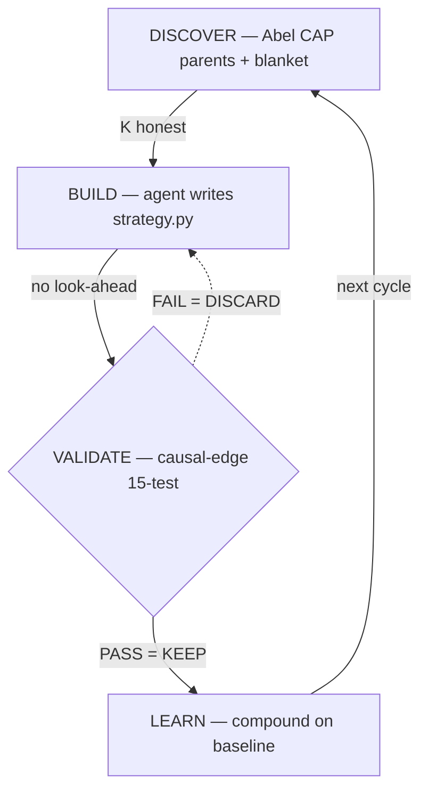

# causal-alpha

**Causal alpha discovery for AI agents. Three layers: code enforces, skill guides, agent discovers.**

```bash
pip install git+https://github.com/cauchyturing/causal-edge.git
causal-edge research init TSLA     # Abel discovery + workspace
# edit strategy.py
causal-edge research run           # validate, record, enforce
causal-edge research status        # progress
```



## Three-Layer Design

```
L1: Code enforce (LLM-agnostic)     → causal-edge research CLI
    K auto-computed from strategy.py AST
    validate_strategy() runs every experiment
    KEEP requires PASS (code refuses otherwise)
    Look-ahead static check before execution

L2: Judgment guidance (skill text)   → SKILL.md (280 words)
    Explore vs exploit distinction
    Micro-cap parents = the signal
    Validation failures = research direction
    When to declare honest failure

L3: Agent autonomy (留白)            → strategy.py
    What architecture, what features, what ML
    Every asset is different
```

**L1 protects all models. L2 improves strong models. L3 is where alpha lives.**

## Why Causal

Correlation breaks when regimes change. Causation doesn't (Pearl, 1995).

- **K is small** — Abel gives ~10 justified parents vs ~10,000 blind scan → DSR honest
- **Signals persist** — causal links survive bull→bear transitions
- **Discovery is automated** — Abel CAP over 11K nodes, agent handles the rest

## Production Proof

Tested across 6 assets (crypto + equity), 200+ serial experiments:

- All strategies pass [causal-edge](https://github.com/cauchyturing/causal-edge) full validation (15-test suite)
- Sharpe range: 1.7 — 4.3 (after DSR deflation at honest K)
- Architectures discovered by agents: vote ensembles, walk-forward ML, xcorr overlays
- Zero loss years across 4+ year backtests on best strategies
- Fallback works without Abel coverage (sector heuristic peers)

Build your own and validate: `causal-edge validate --csv your_backtest.csv`

## Files

```
SKILL.md                  ← Agent reads this. 280 words. 4 judgment calls.
references/
  experiment-loop.md      ← KEEP rule, explore/exploit, when to stop
  discovery-protocol.md   ← Multihop, blanket, fallback
  constraints.md          ← Look-ahead rules (8 constraints)
  proven-patterns.md      ← Battle evidence for inspiration
  methodology.md          ← Axioms vs constraints
```

## The Ecosystem

```
Abel CAP       → causal graph (discovery)
causal-alpha   → research methodology (this skill)
causal-edge    → validation + enforcement (L1 code)
causal-abel    → Abel API access (cap_probe.py)
```

## License

MIT. Built by [Stephen](https://github.com/cauchyturing) / [Abel AI](https://github.com/Abel-ai-causality/).
